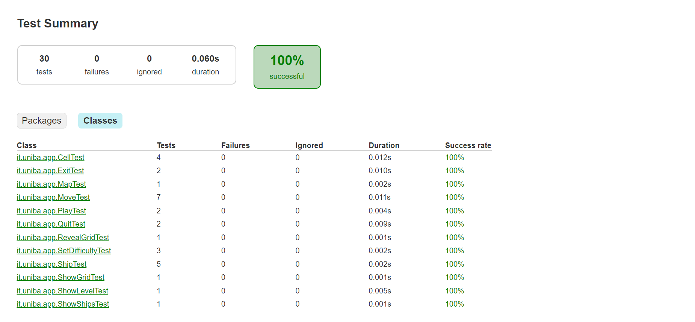
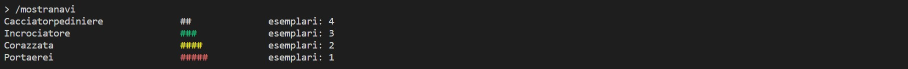
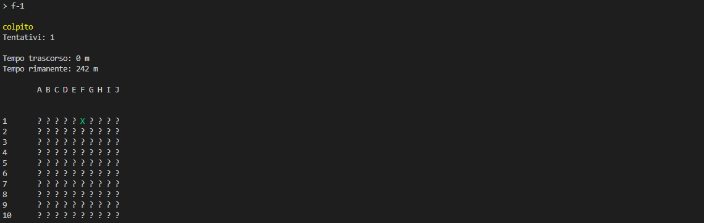

# Report
## Indice
1. [Introduzione](#1-introduzione)
2. [Modello di dominio](#2-modello-di-dominio)
3. [Requisiti specifici](#3-requisiti-specifici) <br>
    3.1 [Requisiti funzionali](#31-requisiti-funzionali) <br>
    3.2 [Requisiti non funzionali](#32-requisiti-non-funzionali) <br>
4. [System Design](#4-system-design) <br>
    4.1 [Design Pattern impiegati](#41-design-pattern-impiegati) <br>
5. [OO Design](#5-oo-design) <br>
    5.1 [Diagramma delle classi completo](#51-diagramma-delle-classi-completo) <br>
    5.2 [Diagrammi comando /gioca](#52-comando-gioca) <br>
    5.3 [Diagrammi comando /abbandona](#53-comando-abbandona) <br>
    5.4 [Diagrammi esecuzione tentativo](#54-esecuzione-tentativo) <br>
6. [Riepilogo del test](#6-riepilogo-del-test)
7. [Manuale utente](#7-manuale-utente)
8. [Processo di Sviluppo e Organizzazione del Lavoro](#8-processo-di-sviluppo-e-organizzazione-del-lavoro) <br>
    8.1 [Processo di Sviluppo adottato](#81-processo-di-sviluppo-adottato) <br>
    8.2 [Organizzazione del Lavoro](#82-organizzazione-del-lavoro) <br>
    8.3 [Tool Utilizzati](#83-tool-utilizzati) <br>
    8.4 [Scelte progettuali intraprese](#84-scelte-progettuali-intraprese) <br>
9. [Analisi Retrospettiva](#9-analisi-retrospettiva) <br>
    9.1 [Sprint 0](#91-sprint-0) <br>
    9.2 [Sprint 1](#92-sprint-1)
    
<br>

# **1. Introduzione**

Nel gioco della battaglia navale in singolo il tuo obiettivo è di distruggere tutte le navi nemiche posizionate su una griglia nascosta, prima che siano esauriti i tentativi a disposizione. Il numero di tentativi a disposizione dipende dalla difficoltà impostata. La griglia è divisa in caselle e il computer posizionerà le navi sulla griglia nascosta in modo casuale e fornirà all'utente la possibilità di tentare di colpire le navi nemiche a turno. Divertiti a giocare contro il computer e sfida te stesso per diventare il miglior comandante navale!

# **2. Modello di dominio**


<br>

# **3. Requisiti specifici**

## **3.1 Requisiti funzionali**

- **RF1**: Come giocatore voglio mostrare l'help con elenco comandi.

    ```
    Criteri di accettazione
        Al comando /help o invocando l'app con flag --help o -h
        il risultato è una descrizione concisa, che normalmente appare all'avvio del programma, seguita dalla lista di comandi disponibili, uno per riga come da esempio successivo:
        •	gioca
        •	esci
        •	...
    ```

- **RF2**: Come giocatore voglio chiudere il gioco.

    ```
    Criteri di accettazione:
        Al comando /esci l'applicazione chiede conferma 
        • se la conferma è positiva, l'applicazione si chiude restituendo il controllo al sistema operativo
        • se la conferma è negativa, l'applicazione si predispone a ricevere nuovi tentativi o comandi
    ```

- **RF3**: Come giocatore voglio impostare il livello di gioco per variare il numero massimo di tentativi sbagliati.

    ```
    Criteri di accettazione:
        Al comando /facile 
        l’applicazione risponde con OK e imposta a 50 il numero massimo di tentativi falliti

        Al comando /medio 
        l’applicazione risponde con OK e imposta a 30 il numero massimo di tentativi falliti

        Al comando /difficile 
        l’applicazione risponde con OK e imposta a 10 il numero massimo di tentativi falliti
    ```
    Nel caso in cui si volesse specificare il numero di tentativi si rimanda al **RF8**.

- **RF4**: Come giocatore voglio mostrare il livello di gioco e il numero di massimo di tentativi falliti.

    ```
    Criteri di accettazione:
        Al comando /mostralivello 
        l’applicazione risponde visualizzando il livello di gioco e il numero di massimo di tentativi falliti
    ```

- **RF5**: Come giocatore voglio mostrare i tipi di nave e il numero.

    ```
    Criteri di accettazione:
        Al comando /mostranavi 
        l’applicazione risponde visualizzando, per ogni tipo di nave, la dimensione in quadrati e il numero di esemplari da affondare:
            -	Cacciatorpediniere    ##       esemplari: 4
            -	Incrociatore          ###      esemplari: 3 
            -	Corazzata             ####     esemplari: 2 
            -	Portaerei             #####    esemplari: 1 
    ```

- **RF6**: Come giocatore voglio iniziare una nuova partita.

    ```
    Al comando /gioca 
    se nessuna partita è in corso l'applicazione imposta casualmente le navi, in orizzontale o in verticale, mostra la griglia vuota e si predispone a ricevere il primo tentativo o altri comandi.
    ```

- **RF7**: Come giocatore voglio svelare la griglia con le navi posizionate.

    ```
    Al comando /svelagriglia 
    l’applicazione risponde visualizzando, una griglia con le righe numerate a partire da 1 e le colonne numerate a partire da A, e tutte le navi posizionate
    ```

- **RF8**: Come giocatore voglio impostare il numero massimo di tentativi falliti per livello di gioco 

    ```
    Criteri di accettazione
    Al comando /facile numero 
    l’applicazione risponde con OK e imposta a numero il numero massimo di tentativi falliti 
    
    Al comando /medio numero 
    l’applicazione risponde con OK e imposta a numero il numero massimo di tentativi falliti 
    
    Al comando /difficile numero 
    l’applicazione risponde con OK e imposta a numero il numero massimo di tentativi falliti 
    ```

- **RF9**: Come giocatore voglio impostare direttamente il numero massimo di tentativi che si possono fallire 

    ```
    Criteri di accettazione 
    Al comando /tentativi numero 
    l’applicazione risponde con OK e imposta a numero il numero massimo di tentativi falliti  
    ```

- **RF10**: Come giocatore voglio impostare la taglia della griglia 

    ```
    Criteri di accettazione 
    Al comando /standard 
    l’applicazione risponde con OK e imposta a 10x10 la dimensione della griglia (è il default) 
    
    Al comando /large 
    l’applicazione risponde con OK e imposta a 18x18 la dimensione della griglia
    
    Al comando /extralarge 
    l’applicazione risponde con OK e imposta a 26x26 la dimensione della griglia  
    ```

- **RF11**: Come giocatore voglio impostare il tempo di gioco 

    ```
    Criteri di accettazione 
    Al comando /tempo numero 
    l’applicazione risponde con OK e imposta a numero il numero minuti a disposizione per giocare 
    ```

- **RF12**: Come giocatore voglio mostrare il tempo di gioco 

    ```
    Al comando /mostratempo 
    l’applicazione risponde visualizzando il numero di minuti trascorsi nel gioco e il numero di minuti ancora disponibili 
    ```

- **RF13**: Come giocatore voglio effettuare un tentativo per colpire una nave 

    ```
    Criteri di accettazione 
    Digitando una coppia di caratteri separati da un trattino, corrispondenti rispettivamente al numero di riga e alla lettera della colonna, (es. B-4), l’applicazione risponde  
    - “acqua” se sulla cella non è posizionata nessuna nave;
    - "colpito" se sulla cella è posizionata una nave;
    - "colpito e affondato" se sulla cella è posizionata una nave ed è l’ultima cella non colpita della nave.  
    
    Qualunque sia l’esito del tentativo, l’applicazione mostra la griglia con le navi colpite parzialmente o affondate, il numero di tentativi già effettuati, e il tempo trascorso.  
    
    La partita termina con successo se il tentativo ha affondato l’ultima nave. 
    
    La partita termina con insuccesso se è stato raggiunto il numero massimo di tentativi falliti o se è scaduto il tempo di gioco.  
    ```

- **RF14**: Come giocatore voglio mostrare la griglia con le navi colpite e affondate 

    ```
    Criteri di accettazione 
    Al comando /mostragriglia
    l’applicazione risponde visualizzando, una griglia con le righe numerate a partire da 1 e le colonne numerate a partire da A, con le navi affondate e le sole parti già colpite delle navi non affondate. 
    ```

- **RF15**: Come giocatore voglio mostrare il numero di tentativi già effettuati e il numero di tentativi falliti 

    ```
    Criteri di accettazione 
    Al comando /mostratentativi  
    l’applicazione risponde visualizzando il numero di tentativi già effettuati, il numero di tentativi falliti e il numero massimo di tentativi falliti   
    ```

- **RF16**: Come giocatore voglio abbandonare una partita 

    ```
    Criteri di accettazione: 
    Al comando /abbandona 
    l'applicazione chiede conferma  
    - se la conferma è positiva, l’applicazione risponde visualizzando sulla griglia la posizione di tutte le navi e si predispone a ricevere nuovi comandi  
    - se la conferma è negativa, l'applicazione si predispone a ricevere nuovi tentativi o comandi  
    ```

<br>

## **3.2 Requisiti non funzionali**
- **RNF1**: il container docker dell’app deve essere eseguito da terminali che supportano Unicode con encoding UTF-8 o UTF-16.

    **Elenco dei terminali supportati:**
    - **Linux:**
        - terminal
    - **Windows:**
        - Powershell
        - Git Bash (in questo caso il comando Docker ha come prefisso winpty; es: winpty docker -it ....)
    
    <br>

    **Comando per l’esecuzione del container** <br>
    Dopo aver eseguito il comando docker pull copiandolo da GitHub Packages, Il comando Docker da usare per eseguire il container contenente l’applicazione è:
    ```
    docker run --rm -it ghcr.io/softeng2223-inf-uniba/battleship-dijkstra:latest
    ```
<br>

# **4. System Design**

Nel contesto specifico di questo progetto, abbiamo valutato che la creazione di diagrammi avrebbe comportato un carico di lavoro aggiuntivo, senza fornire un valore significativo al nostro risultato finale (basti ad esempio pensare che un eventuale diagramma dei package non sarebbe potuto essere rappresentato, vista la presenza di un solo package all'interno dell'intero progetto) . Abbiamo quindi deciso di concentrare il nostro tempo sull'effettiva implementazione del software, assicurandoci comunque di mantenere una progettazione chiara e organizzata, anche se non formalmente documentata.

Nonostante la mancanza di una rappresentazione architetturale esplicita, abbiamo seguito le best practice generali per sviluppare un software di qualità. Abbiamo posto particolare attenzione sull'applicazione del principio di _Information Hiding_, che ci ha permesso di nascondere i dettagli implementativi all'esterno dei moduli e favorire la modularità del nostro sistema. Altro principio di Object Oriented Design adottato è quello di _Presentazione Separata_ (applicato con la creazione della classe Shell) che consiste nel separare la parte di codice relativa alla presentazione da quella relativa al resto dell'applicazione.  Questo approccio ci ha aiutato a migliorare la manutenibilità del codice e ad adattarci facilmente a futuri cambiamenti senza influire sull'intero sistema.

<br>

## **4.1 Design Pattern impiegati**

In termini di Design Pattern impiegati, é stato fatto riferimento al design pattern *Singleton* per la definizione della classe `Shell`; tale scelta é stata adoperata in quanto, per il corretto funzionamento del programma, é necessario garantire l'univocitá dell'istanza di tale classe, poiché essa rappresenta il dispositivo terminale di output.

<br>

# **5. OO Design**
## **5.1 Diagramma delle classi completo**
<br>


Le classi classificate come << entity >> sono state progettate per seguire i principi di Information Hiding, Alta coesione, Basso accoppiamento, DRY (Do Not Repeat Yourself) e i principi SOLID. Ogni classe << entity >> nasconde i dettagli implementativi e la sua rappresentazione fornendo, allo stesso tempo, interfacce per la sua manipolazione. L'Alta coesione in combinazione con l'Information Hiding ci ha permesso di manipolare tali oggetti in modo sicuro e ci ha permesso di limitare al minimo le eventuali modifiche da applicare. E' stato, inoltre, seguito il principio di Presentazione Separata mediante la separazione tra le responsabilità di interfacciamento, con il terminale per l'output di programma, (gestito dalla classe << boundary >> `Shell`) e la logica di dominio (gestita dalla classe << control >> `App`). L'unica classe non classificata secondo la classificazione ECB è `ANSICodes` la quale, essendo una sola classe utilitaria, può essere sfruttata dalle altre classi senza violare nessuno dei principi sopra citati.
<br>

## **5.2 Comando /gioca**
### **5.2.1 Diagramma delle classi**


<br>

### **5.2.2 Diagramma di sequenza**

<br>

## **5.3 Comando /abbandona**
### **5.3.1 Diagramma delle classi**


<br>

### **5.3.2 Diagramma di sequenza**

<br>

## **5.4 Esecuzione Tentativo**
### **5.4.1 Diagramma delle classi**


<br>

### **5.4.2 Diagramma di sequenza**

<br>

# **6. Riepilogo del test**
## **6.1 Criteri di localizzazione adottati**
Di seguito é riportata una tabella riassuntiva, contenente maggiori informazioni sui test definiti ed eseguiti all'interno del progetto.



Come visibile dalla tabella, le classi di test facenti parte del progetto sono parte del package `it.uniba.it.app`, cosí da avere una struttura della cartella delle classi di test che rispecchia la struttura della cartella `main`, contenente le classi utilizzate per la definizione del progetto. In aggiunta alle classi di test, progettate per eseguire test di unitá e di integrazione tra le varie classi, é stata doverosa l'aggiunta di una classe utilitaria, `OutputHandler`. <br>

La definizione della classe utilitaria `OutputHandler` é dovuta alla necessitá di voler risolvere eventuali problematiche, riscontrate durante il testing di metodi che richiedono l'analisi di stringhe di caratteri. Mediante questa classe, infatti, la stringa viene formattata in modo tale da rimuovere eventuali caratteri (o sequenze di caratteri) che potrebbero portare ad un risultato errato del test.

<br>

## **6.2 Criteri di selezione adottati**
In merito al criterio di selezione dei metodi adottato, si é deciso di rispettare il seguente criterio di copertura:
- Nel caso di classi di tipo _Entity_, si é cercato di verificare il corretto funzionamento di tutti i metodi pubblici, che costituiranno le interfacce di tali oggetti;
- Nel caso della classe `App`, di tipo _Control_, a seguito di un Daily Scrum Meeting, é stata presa la decisione di modificare la visibilità di alcuni metodi da "privato" a "pubblico", con lo scopo di poter eseguire il testing delle singole user stories.

Il cambiamento di visibilità di tali metodi non viola i principi di OO Design, in quanto la loro esecuzione consente una modifica dello stato della classe `App` in modo consistente, garantendone l'integrità dei dati. 

<br>

# **7. Manuale Utente**
All'avvio del programma all'utente viene mostrata una descrizione concisa del gioco ed, inoltre, ha la possibilità di scegliere tra un insieme di comandi, ovvero:
```
1.  /help             mostra l'elenco dei comandi disponibili
2.  /gioca            avvia una nuova partita
3.  /mostranavi       mostra le navi da affondare presenti sulla griglia
4.  /tempo numero     imposta la durata massima di gioco in minuti
5.  /facile           imposta la difficoltà a facile [default: 50 tentativi]
6.  /facile numero    imposta un nuovo numero di tentativi per la difficoltà facile
7.  /medio            imposta la difficoltà a medio [default: 30 tentativi]
8.  /medio numero     imposta un nuovo numero di tentativi per la difficoltà media
9.  /difficile        imposta la difficoltà a difficile [default: 10 tentativi]
10. /difficile numero imposta un nuovo numero di tentativi per la difficoltà difficile
11. /tentativi numero imposta un nuovo numero di tentativi per tutte le difficolta'
12. /mostralivello    mostra il livello di difficoltà impostato
13. /standard         imposta a 10x10 la dimensione della griglia
14. /large            imposta a 18x18 la dimensione della griglia
15. /extralarge       imposta a 26x26 la dimensione della griglia
16. /mostragriglia    mostra la griglia di gioco
17. /mostratempo      visualizza i minuti trascorsi e i minuti ancora disponibili
18. /mostratentativi  visualizza il numero di tentativi falliti, rimasti e il massimo di tentativi falliti
19. /svelagriglia     mostra la griglia con le navi posizionate
20. /abbandona        abbandona la partita in corso
21. /esci             termina il gioco
Per effettuare un tentativo, digitare le coordinate da colpire nella forma <lettera>-<numero>, ad esempio A-1, B-5, C-10, D-26, ecc.
```
Se l'utente sceglie il comando ```/help``` verrà mostrata la descrizione del gioco e la lista dei comandi selezionabili. 


Se l'utente (dopo aver impostato la difficoltà del gioco) sceglie il comando ```/gioca```  verrà mostrata a schermo la griglia, della dimensione selezionata, vuota (si è scelto di utilizzare il simbolo "_?_" per indicare le varie celle vuote della griglia). Nel caso in cui l'utente abbia selezionato questo comando senza aver prima scelto il tempo di gioco allora verrà mostrato un messaggio di errore: _"Non hai impostato un timer di gioco! Digita /tempo numero per impostarlo."_, di conseguenza il gioco non potrà iniziare e l'utente dovrà necessariamente impostare il tempo di gioco. 


Se l'utente sceglie il comando ```/esci``` allora potrà uscire dal gioco (dopo aver confermato le sue intenzioni con il comando "_s_").
Nel caso in cui il comando venga selezionato per sbaglio l'utente ha la possibilità di rispondere "_n_", di conseguenza potranno essere inseriti nuovi comandi. 


Se l'utente sceglie il comando ```/facile``` l'applicazione risponde con "_Ok!_" e imposta il numero massimo di tentativi a 50. Questo livello di difficoltà corrisponde al livello di default.


Se l'utente sceglie il comando ```/medio``` l'applicazione 
risponde con "_Ok!_" e imposta il numero massimo di tentativi a 30. 


Se l'utente sceglie il comando ```/difficile``` l'applicazione 
risponde con "_Ok!_" e imposta il numero massimo di tentativi a 10. 


Nel caso in cui l'utente cerchi di modificare la difficoltà, mentre è in corso una partita, verrà mostrato il messaggio di errore: _"La partita è già iniziata!"_.


Se l'utente sceglie il comando ```/mostralivello``` verrà mostrato il livello della partita che si sta giocando con il relativo numero massimo di tentativi.


Se l'utente sceglie il comando ```/mostranavi``` verrà mostrato a schermo, per ogni tipo di nave, la dimensione in quadrati e il numero di esemplari da affondare.



Se l'utente sceglie il comando ```/svelagriglia``` verrà mostrato a schermo la griglia, della dimensione selezionata, e l'utente potrà vedere la posizione giusta delle navi non ancora affondate. Come team abbiamo scelto di rappresentare ogni nave con un colore diverso (per renderle più facilmente distinguibili), in particolare: 
- Cacciatorpediniere: _bianco_,
- Incrociatore: _verde_,
- Corazzata: _giallo_,
- Portaerei: _rosso_.


Nel caso in cui l'utente non inserisca nessuno tra questi comandi, verrà mostrato il messaggio di errore: _"Comando inesistente o non riconosciuto."_


Se l'utente sceglie il comando ```/facile numero```, ```/medio numero``` o ```/difficile numero``` l'applicazione risponde con "_Ok!_" e imposta il numero massimo di tentativi relativi alla difficoltà inserita a numero.


Se l'utente sceglie il comando ```/tentativi numero``` l'applicazione risponde con "_Ok!_" e imposta il numero massimo di tentativi a numero per tutte le difficoltà.


Nel caso in cui l'utente cerchi di modificare il numero di tentativi, mentre è in corso una partita, verrà mostrato il messaggio di errore: _"La partita è già iniziata!"_.


Nel caso in cui l'utente inserisca un valore di numero negativo o non numerico, verrà mostrato il messaggio di errore: _"Numero non valido."_ oppure _"Non puoi impostare un numero di tentativi negativo o uguale a zero."_.


Se l'utente sceglie il comando ```/standard```, ```/large``` o ```/extralarge``` l'applicazione risponde con "_Ok!_" e imposta la dimensione della griglia a 10x10, 18x18 o 26x26 rispettivamente.


Nel caso in cui l'utente cerchi di modificare la dimensione della griglia, mentre è in corso una partita, verrà mostrato il messaggio di errore: _"La partita è già iniziata!"_.


Se l'utente sceglie il comando ```/mostragriglia``` verrà mostrato a schermo la griglia di gioco aggiornata in base alle mosse precedentemente eseguite.


Nel caso in cui l'utente cerchi di mostrare la griglia, mentre non è in corso una partita, verrà mostrato il messaggio di errore: _"Non e' in esecuzione nessuna partita!. Digita /gioca per iniziare una nuova partita!"_.


Se l'utente sceglie il comando ```/tempo numero``` l'applicazione risponde con "_Ok!_" e imposta il tempo massimo di gioco a numero minuti.


Nel caso in cui l'utente cerchi di modificare il tempo di gioco, mentre è in corso una partita, verrà mostrato il messaggio di errore: _"La partita è già iniziata!"_.


Nel caso in cui l'utente inserisca un valore di numero negativo o non numerico, verrà mostrato il messaggio di errore: _"Numero non valido."_ oppure _"Non puoi impostare un tempo negativo o uguale a zero."_.


Se l'utente sceglie il comando ```/mostratempo``` verrà mostrato a schermo il tempo trascorso e rimanente prima che la partita termini.


Nel caso in cui l'utente cerchi di mostrare il tempo, mentre non è in corso una partita, verrà mostrato il messaggio di errore: _"Non e' in esecuzione nessuna partita!. Digita /gioca per iniziare una nuova partita!"_.


Se l'utente sceglie il comando ```/abbandona``` abbandona la partita attuale (dopo aver confermato le sue intenzioni con il comando "_s_").
Nel caso in cui il comando venga selezionato per sbaglio l'utente ha la possibilità di rispondere "_n_", di conseguenza l'utente potrà continuare la partita.

Se l'utente sceglie confermare la sua intenzione di abbandonare la partita, l'applicazione mostra la griglia di gioco con tutte le navi posizionate.


Nel caso in cui l'utente cerchi di abbandonare la partita, mentre non è in corso una partita, verrà mostrato il messaggio di errore: _"Non e' in esecuzione nessuna partita!. Digita /gioca per iniziare una nuova partita!"_.


Se l'utente sceglie il comando ```/mostratentativi``` verrà mostrato a schermo il numero di tentativi effettuati e falliti più il numero massimo di tentativi che si possono fallire.


Nel caso in cui l'utente cerchi di mostrare i tentativi, mentre non è in corso una partita, verrà mostrato il messaggio di errore: _"Non e' in esecuzione nessuna partita!. Digita /gioca per iniziare una nuova partita!"_.


Per effettuare un tentativo, l'utente deve digitare le coordinate da colpire nella forma ```<lettera>-<numero>```, ad esempio ```A-1```, ```B-5```, ```C-10```, ```D-26```, ecc. <br>
L’applicazione risponde con:
- ```acqua``` se sulla cella non è posizionata nessuna nave;
- ```colpito``` se sulla cella è posizionata una nave;
- ```colpito e affondato``` se sulla cella è posizionata una nave ed è l’ultima cella non colpita della nave.  





Nel caso in cui l'utente cerchi di effettuare un tentativo, mentre non è in corso una partita, verrà mostrato il messaggio di errore: _"Non e' in esecuzione nessuna partita!. Digita /gioca per iniziare una nuova partita!"_.


Nel caso in cui l'utente inserisca un valore di coordinate non valido, verrà mostrato il messaggio di errore: _"Il comando inserito contiene caratteri al di fuori della mappa. Rispettare le dimensioni della mappa specificate."_.


<br>

# **8. Processo di Sviluppo e Organizzazione del Lavoro**

## **8.1 Processo di Sviluppo adottato**
Il gruppo Dijkstra per la realizzazione di questo progetto ha scelto di adottare il processo di sviluppo agile, più in particolare utilizzando il framework Scrum facendo riferimento anche al [codice di condotta](./CODE_OF_CONDUCT.md).

All'inizio di ogni Sprint si è svolto un Meeting di Retrospettiva con l'obiettivo di eseguire una revisione dello Sprint precedente per individuare problematiche riscontrate durante lo svolgimento, nonchè proporre miglioramenti relativi anche dal punto di vista della produttività e dell'efficienza del gruppo.

<br>

## **8.2 Organizzazione del Lavoro**

Per coordinare il lavoro, il gruppo ha utilizzato (oltre ai meeting fisici) diverse piattaforme di comunicazione, tra cui **Whatsapp** e **Discord**. Questi strumenti hanno facilitato la condivisione di file, immagini e documentazione, nonché la discussione dei problemi incontrati durante lo sviluppo.


In particolare, **Whatsapp** è stato utilizzato per decidere e organizzare meeting periodici, oltre a incontri straordinari per questioni di rilevanza. I meeting si sono poi svolti su **Discord**, dove è stato creato un server privato di comunicazione con canali specifici per mantenere ordine e organizzazione. Questo ci ha permesso di gestire al meglio la nostra collaborazione permettendoci di eseguire una corretta suddivisione del carico di lavoro.

Per quanto riguarda i meeting periodici, questi sono stati programmati ogni fine settimana al fine di rispettare gli impegni di tutti i componenti del team. Essi avevano una durata variabile in base alle funzionalità da implementare e da aggiornare. Durante questi incontri i membri generalmente si suddividevano in sottogruppi per realizzare task differenti. La formazione dei sottogruppi era variabile al fine di confrontare i diversi punti di vista, fornendo supporto in caso di difficoltà riscontrate nell'avanzamento del lavoro.

L'utilizzo di queste piattaforme di comunicazione e l'organizzazione dei meeting hanno contribuito a mantenere un flusso di lavoro efficiente e una collaborazione continua all'interno del gruppo.

<br>

## **8.3 Tool Utilizzati**

Per lo svolgimento delle varie attività sono stati utilizzati una serie di tool. <br>
Uno di questi è stato **Microsoft Whiteboard**, utilizzato per la relizzazione delle analisi retrospettive secondo lo schema Arrabbiato/Triste/Felice e per la creazione di bozze inerenti i diagrammi delle classi (con prospettiva concettuale e sw). Tali bozze sono poi state rielaborate in **StarUML** e/o **Draw.io**, per schematizzare al meglio i concetti.

<br>

## **8.4 Scelte progettuali intraprese**
In seguito alla definizione del codice e all'esecuzione della build mediante il tool _Gradle_, é stato visualizzato un warning da parte di SpotBugs, che al termine del programma si é deciso di non risolvere.
- Il warning in questione é legato al costruttore della classe `Cell.java`, avente come parametro formale un oggetto di classe `Ship`. All'interno di questo costruttore, infatti, all'attributo di classe `Ship` viene assegnato in modo diretto un oggetto appartenente alla stessa classe, senza ricorrere al metodo `setShip()` della classe `Cell`, grazie al quale sarebbe possibile impedire ad un eventuale codice malevolo di modificare erroneamente il valore di tale attributo. <br><br>
Tuttavia, si tratta di un comportamento desiderato. Nel momento in cui determiniamo la posizione di una nave all'interno della mappa, é necessario assegnare alle celle corrispondenti lo stesso oggetto; tale comportamento é fondamentale, poiché, nel momento in cui una nave viene colpita, si devono decrementare i suoi punti vita, cosí da poter individuare il momento in cui essa risulta affondata.

Non ricorrendo a tale implementazione, e quindi utilizzando il metodo `setShip()`, alle varie celle della stessa nave verrebbero assegnati due oggetti differenti, non permettendo cosí al programma di decrementare i punti vita della nave, e quindi di affondarla come previsto.

<br>

# **9. Analisi Retrospettiva**

## **9.1 Sprint 0**


## **9.2 Sprint 1**

