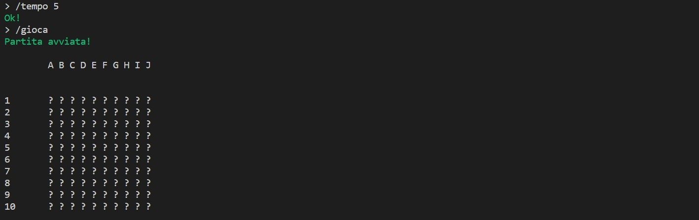
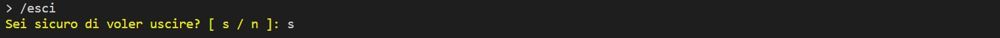
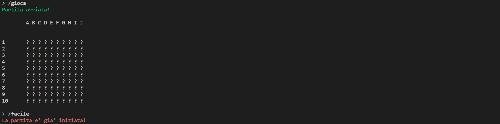

# Report
## Indice
1. [Introduzione](#1-introduzione)
2. [Modello di dominio](#2-modello-di-dominio)
3. [Requisiti specifici](#3-requisiti-specifici) <br>
    3.1 [Requisiti funzionali](#31-requisiti-funzionali) <br>
    3.2 [Requisiti non funzionali](#32-requisiti-non-funzionali)
4. [System Design](#4-system-design)
5. [OO Design](#5-oo-design)
6. [Riepilogo del test](#6-riepilogo-del-test)
7. [Manuale utente](#7-manuale-utente)
8. [Processo di sviluppo e organizzazione del lavoro](#8-processo-di-sviluppo-e-organizzazione-del-lavoro)
9. [Analisi retrospettiva](#9-analisi-retrospettiva) <br>
    9.1 [Sprint 0](#91-sprint-0)
    
<br>

# **1. Introduzione**

Nel gioco della battaglia navale in singolo il tuo obiettivo è di distruggere tutte le navi nemiche posizionate su una griglia nascosta, prima che siano esauriti i tentativi a disposizione. Il numero di tentativi a disposizione dipende dalla difficoltà impostata. La griglia è divisa in caselle e il computer posizionerà le navi sulla griglia nascosta in modo casuale e fornirà all'utente la possibilità di tentare di colpire le navi nemiche a turno. Divertiti a giocare contro il computer e sfida te stesso per diventare il miglior comandante navale!

# **2. Modello di dominio**


<br>

# **3. Requisiti specifici**

## **3.1 Requisiti funzionali**

- **RF1**: Come giocatore voglio mostrare l'help con elenco comandi.

    ```
    Criteri di accettazione
        Al comando /help o invocando l'app con flag --help o -h
        il risultato è una descrizione concisa, che normalmente appare all'avvio del programma, seguita dalla lista di comandi disponibili, uno per riga come da esempio successivo:
        •	gioca
        •	esci
        •	...
    ```

- **RF2**: Come giocatore voglio chiudere il gioco.

    ```
    Criteri di accettazione:
        Al comando /esci l'applicazione chiede conferma 
        • se la conferma è positiva, l'applicazione si chiude restituendo il controllo al sistema operativo
        • se la conferma è negativa, l'applicazione si predispone a ricevere nuovi tentativi o comandi
    ```

- **RF3**: Come giocatore voglio impostare il livello di gioco per variare il numero massimo di tentativi sbagliati.

    ```
    Criteri di accettazione:
        Al comando /facile 
        l’applicazione risponde con OK e imposta a 50 il numero massimo di tentativi falliti

        Al comando /medio 
        l’applicazione risponde con OK e imposta a 30 il numero massimo di tentativi falliti

        Al comando /difficile 
        l’applicazione risponde con OK e imposta a 10 il numero massimo di tentativi falliti
    ```

- **RF4**: Come giocatore voglio mostrare il livello di gioco e il numero di massimo di tentativi falliti.

    ```
    Criteri di accettazione:
        Al comando /mostralivello 
        l’applicazione risponde visualizzando il livello di gioco e il numero di massimo di tentativi falliti
    ```

- **RF5**: Come giocatore voglio mostrare i tipi di nave e il numero.

    ```
    Criteri di accettazione:
        Al comando /mostranavi 
        l’applicazione risponde visualizzando, per ogni tipo di nave, la dimensione in quadrati e il numero di esemplari da affondare:
            -	Cacciatorpediniere    ##       esemplari: 4
            -	Incrociatore          ###      esemplari: 3 
            -	Corazzata             ####     esemplari: 2 
            -	Portaerei             #####    esemplari: 1 
    ```

- **RF6**: Come giocatore voglio iniziare una nuova partita.

    ```
    Al comando /gioca 
    se nessuna partita è in corso l'applicazione imposta causalmente le navi, in orizzontale o in verticale, mostra la griglia vuota e si predispone a ricevere il primo tentativo o altri comandi.
    ```

- **RF7**: Come giocatore voglio svelare la griglia con le navi posizionate.

    ```
    Al comando /svelagriglia 
    l’applicazione risponde visualizzando, una griglia 10x10, con le righe numerate da 1 a 10 e le colonne numerate da A a J, e tutte le navi posizionate  
    ```
<br>

## **3.2 Requisiti non funzionali**
- **RNF1**: il container docker dell’app deve essere eseguito da terminali che supportano Unicode con encoding UTF-8 o UTF-16.

    **Elenco dei terminali supportati:**
    - **Linux:**
        - terminal
    - **Windows:**
        - Powershell
        - Git Bash (in questo caso il comando Docker ha come prefisso winpty; es: winpty docker -it ....)
    
    <br>

    **Comando per l’esecuzione del container** <br>
    Dopo aver eseguito il comando docker pull copiandolo da GitHub Packages, Il comando Docker da usare per eseguire il container contenente l’applicazione è:
    ```
    docker run --rm -it ghcr.io/softeng2223-inf-uniba/battleship-dijkstra:latest
    ```
<br>

# **4. System Design**
<br>

# **5. OO Design**
<br>

# **6. Riepilogo Del Test**
<br>

# **7. Manuale Utente**
All'avvio del programma all'utente viene mostrata una descrizione concisa del gioco ed, inoltre, ha la possibilità di scegliere tra un insieme di comandi, ovvero:
```
1. /help
2. /gioca
3. /esci
4. /facile
5. /medio
6. /difficile
7. /mostralivello
8. /mostranavi
9. /svelagriglia
```
Se l'utente sceglie il comando ```/help``` verrà mostrata la descrizione del gioco e la lista dei comandi selezionabili. 


Se l'utente (dopo aver impostato la difficoltà del gioco) sceglie il comando ```/gioca```  verrà mostrata a schermo la griglia 10x10 vuota (si è scelto di utilizzare il simbolo "_?_" per indicare le varie celle vuote della griglia). Nel caso in cui l'utente abbia selezionato questo comando senza aver prima scelto il livello di difficoltà allora verrà mostrato un messaggio di errore: _"Non è stata impostata alcuna difficoltà! Digitare /facile, /medio o /difficile per impostare una difficoltà!"_, di conseguenza il gioco non potrà iniziare e l'utente dovrà necessariamente selezionare il livello di difficoltà. 




Se l'utente sceglie il comando ```/esci``` allora potrà uscire dal gioco (dopo aver confermato le sue intenzioni con il comando "_s_").
Nel caso in cui il comando venga selezionato per sbaglio l'utente ha la possibilità di rispondere "_n_", di conseguenza potranno essere inseriti nuovi comandi. 




Se l'utente sceglie il comando ```/facile``` l'applicazione risponde con "_Ok!_" e imposta il numero massimo di tentativi a 50. 


Se l'utente sceglie il comando ```/medio``` l'applicazione 
risponde con "_Ok!_" e imposta il numero massimo di tentativi a 30. 


Se l'utente sceglie il comando ```/difficile``` l'applicazione 
risponde con "_Ok!_" e imposta il numero massimo di tentativi a 10. 


Nel caso in cui l'utente cerchi di modificare la difficoltà, mentre è in corso una partita, verrà mostrato il messaggio di errore: _"La partita è già iniziata!"_.



Se l'utente sceglie il comando ```/mostralivello``` verrà mostrato il livello della partita che si sta giocando con il relativo numero massimo di tentativi. Se questo comando viene scelto quando ancora la partita non è iniziata l'utente visualizzerà il messaggio di errore: _"Non e' stata impostata alcuna difficoltà"_.


Se l'utente sceglie il comando ```/mostranavi``` verrà mostrato a schermo, per ogni tipo di nave, la dimensione in quadrati e il numero di esemplari da affondare.


Se l'utente sceglie il comando ```/svelagriglia``` verrà mostrato a schermo la griglia 10x10 e l'utente potrà vedere la posizione giusta delle navi non ancora affondate. Come team abbiamo scelto di rappresentare ogni nave con un colore diverso (per renderle più facilmente distinguibili), in particolare: 
- Cacciatorpediniere: _bianco_,
- Incrociatore: _verde_,
- Corazzata: _giallo_,
- Portaerei: _rosso_.


Nel caso in cui l'utente non inserisca nessuno tra questi comandi, verrà mostrato il messaggio di errore: _"Comando inesistente o non riconosciuto."_


<br>

# **8. Processo di Sviluppo e Organizzazione del Lavoro**
<br>

# **9. Analisi Retrospettiva**

## **9.1 Sprint 0**


